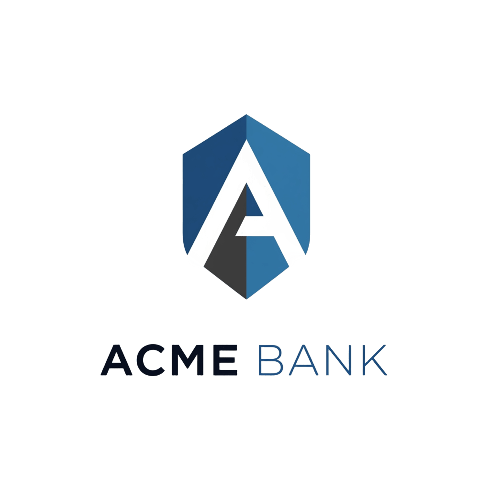

# Banco Acme - Sistema de Autogestión Bancaria



**Desarrollado por:** Isabella Carrillo azain, Juan Jose Arrublas Gutierrez
**Versión:** 1.0.0  
**Última actualización:** [11/06/2025]

## Tabla de Contenidos
- [Descripción](#-descripción)
- [Funcionalidades](#-funcionalidades)
- [Tecnologías](#-tecnologías)
- [Estructura del Proyecto](#-estructura-del-proyecto)
- [Instalación](#-instalación)
- [Uso](#-uso)
- [Capturas de Pantalla](#-capturas-de-pantalla)
- [Contribución](#-contribución)
- [Licencia](#-licencia)
- [Contacto](#-contacto)

## 📝 Descripción

Aplicación web para la autogestión de cuentas bancarias del Banco Acme que permite a los usuarios:

- Acceder a su cuenta mediante autenticación segura
- Realizar operaciones bancarias básicas
- Consultar movimientos y generar reportes
- Administrar su perfil y seguridad

## 🎯 Funcionalidades

### Autenticación
- ✅ Inicio de sesión con validación en tiempo real
- ✅ Registro de nuevos clientes
- ✅ Recuperación de contraseña
- ✅ Cierre de sesión seguro

### Operaciones Bancarias
- 💰 Consignaciones electrónicas
- 🏧 Retiros de dinero
- 💡 Pago de servicios públicos
- 📊 Consulta de saldo

### Reportes
- 📑 Extracto bancario mensual
- 🏦 Certificado bancario digital
- 🖨️ Funcionalidad de impresión

### Seguridad
- 🔒 Persistencia de datos encriptados
- 🛡️ Validación de formularios
- 📱 Diseño responsive para todos los dispositivos

## 💻 Tecnologías

**Frontend:**
- HTML5 semántico
- CSS3 con Flexbox y Grid
- JavaScript 
- LocalStorage para persistencia
- Google Firebase

**Herramientas:**
- Git para control de versiones
- GitHub para colaboración
- Google Fonts para tipografía
- Font Awesome para iconos
- Google Firebase para Base datos dinamica

## 🚀 Instalación

1. Clonar el repositorio:
```bash
git clone https://github.com/arrublas1208/.git
cd banco-acme